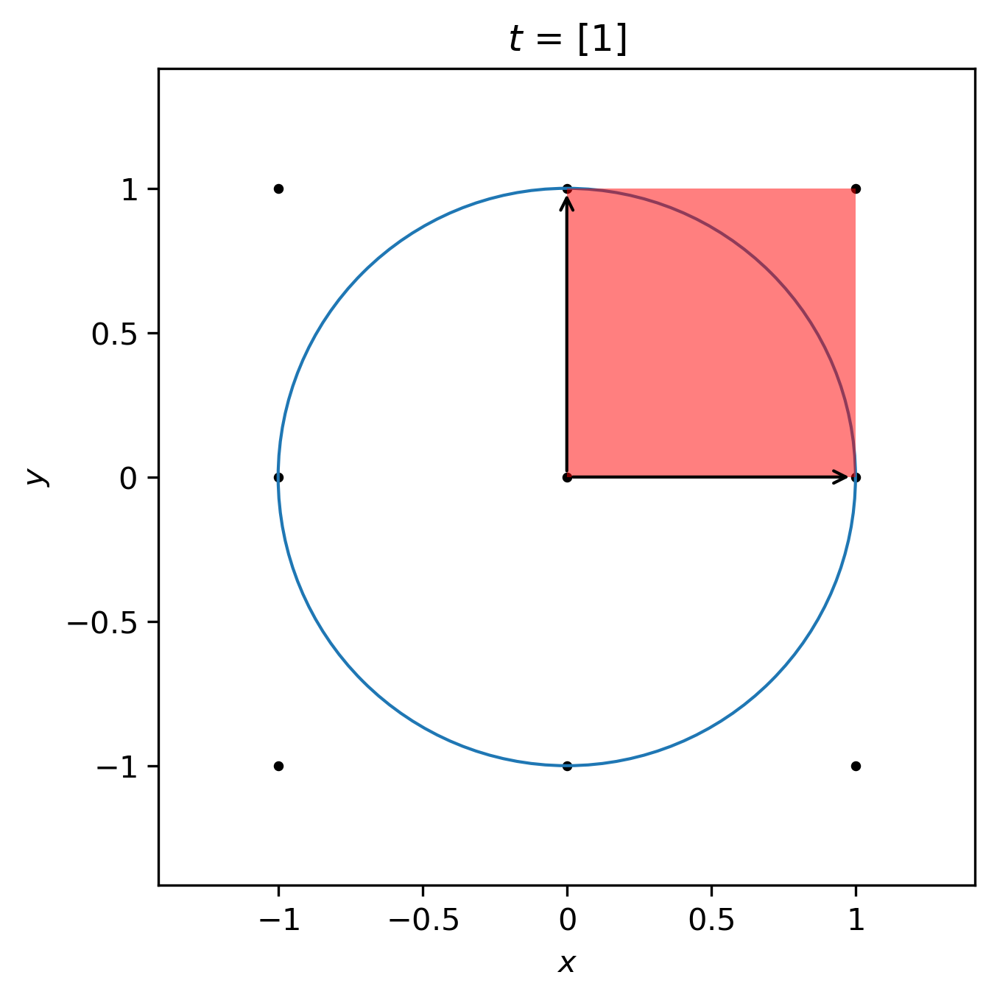

Overview
========

|docs| |pytests| |license|

.. |docs| image:: https://github.com/HofstadterTools/HofstadterTools.github.io/actions/workflows/docs.yml/badge.svg
   :target: https://github.com/HofstadterTools/HofstadterTools.github.io/actions/workflows/docs.yml

.. |pytests| image:: https://github.com/HofstadterTools/HofstadterTools.github.io/actions/workflows/pytests.yml/badge.svg
   :target: https://github.com/HofstadterTools/HofstadterTools.github.io/actions/workflows/pytests.yml

.. |license| image:: https://badgen.net/badge/license/GPLv3/blue
   :target: https://www.gnu.org/licenses/gpl-3.0

* GitHub Repository: https://github.com/HofstadterTools/HofstadterTools.github.io
* Documentation: https://hofstadter.tools or `hof.tools <https://hofstadter.tools>`__

**H**\ ofstadter\ **T**\ ools (\ **HT**) is a set of Python programs and classes for analyzing the Hofstadter model, which describes the behavior of non-interacting quantum particles hopping on a lattice coupled to a perpendicular gauge field. This package can be used to compute the band structure of a *generalized* Hofstadter model on *any* regular Euclidean lattice, as well as its key properties, such as quantum geometry and topology.

.. admonition:: About the name

		Philip Harper first derived the difference equation for the model :cite:`Harper55`, which was later analyzed in detail by Mark Azbel :cite:`Azbel64`, and finally plotted by Douglas Hofstadter :cite:`Hofstadter76`. Consequently, the formal name for the model is the *Harper-Azbel-Hofstadter model* to credit its three main contributors.

Quick Start
-----------

Using HofstadterTools is quick and easy! Assuming the recommended scenario of a Linux/Unix kernel with `git <https://git-scm.com/book/en/v2/Getting-Started-Installing-Git>`__ and `Miniconda <https://docs.conda.io/en/latest/miniconda.html>`__ installed:

.. code:: console

		(base) user@domain:~$ git clone git@github.com:HofstadterTools/HofstadterTools.github.io.git HofstadterTools
		(base) user@domain:~$ cd HofstadterTools
		(base) user@domain:~/HofstadterTools$ conda env create -f environment.yml
		(base) user@domain:~/HofstadterTools$ conda activate HT
		(HT) user@domain:~/HofstadterTools$ cd code
		(HT) user@domain:~/HofstadterTools/code$ python band_structure.py -lat square -nphi 1 4 --display both --wilson

.. image:: images/overview/band_structure_3D_both_square_nphi_1_4_t_1.png
    :width: 33 %
    :alt: 3D Band Structure (see documentation)
.. image:: images/overview/wilson_both_square_nphi_1_4_t_1.png
    :width: 33 %
    :alt: Wilson Loops (see documentation)
.. image:: images/overview/band_structure_2D_both_square_nphi_1_4_t_1.png
    :width: 33 %
    :alt: 2D Band Structure (see documentation)

.. code:: console

    (HT) user@domain:~/HofstadterTools/code$ python butterfly.py -lat square -q 97 --color point --wannier --plot_lattice

.. image:: images/overview/butterfly_square_q_97_t_1_col_point_avron.png
    :width: 33 %
    :alt: Butterfly Spectrum (see documentation)
.. image:: images/overview/wannier_square_q_97_t_1_col_point_avron.png
    :width: 33 %
    :alt: Wannier Diagram (see documentation)

Voilà! You have just plotted the Hofstadter band structure for nearest-neighbor hopping on the square lattice at flux density :math:`n_\phi=1/4`, together with the corresponding butterfly spectrum at :math:`q=97`. You can append ``--help`` to either of these programs to view the list of options. Alternatively, you can explore the :doc:`gallery <gallery>` and :ref:`code reference <code_reference>` to see what HofstadterTools has to offer.

Python Environment
------------------

We recommend the use of a python virtual environment to handle the package dependencies. In the following, we assume a Linux/Unix kernel, however these instructions may be readily adapted for Windows.

Using ``conda``:

1) If you have not already, install Anaconda or `Miniconda <https://docs.conda.io/en/latest/miniconda.html>`__ (recommended).
2) On first use, create the ``HT`` environment: ``conda env create -f environment.yml``
3) Whenever you would like to use the environment, run: ``conda activate HT``

Using ``pip``:

1) On most Unix-derived operating systems, ``pip`` is already installed. If not, install `pip <https://packaging.python.org/en/latest/guides/installing-using-pip-and-virtual-environments/#installing-pip>`__.
2) Create the virtual environment (recommended in the project root): ``python -m venv env``
3) Activate the virtual environment: ``source env/bin/activate``
4) Install the dependencies: ``pip install -r requirements.txt``

.. note::

		For compiling the documentation, ``sphinx_rtd_theme`` was installed using pip to get the newer version number (>=0.5.1). This fixes a minor bug with the formatting of unordered lists.

In addition, we recommend adding the following lines to your shell configuration file (e.g. ``.bashrc`` or ``.zshrc``):

.. code:: shell

		export PYTHONPATH=$PYTHONPATH:~/HofstadterTools/code
		export PYTHONUNBUFFERED='True'

The first line ensures that the python path is set for the sources root directory and the second line allows you to check raw data being written to a data file in real-time (e.g. using ``tail -f``).

Directory Structure
-------------------

* **code** -- sources root directory where the python programs and their configuration settings are stored, as well as the namespace packages. A detailed description of the available :doc:`programs <tutorials>` and :ref:`namespace packages <code_reference>` is in the documentation.

	* **configuration** -- user-defined configuration files for the programs.
	* **functions** -- helper functions for the programs.
	* **models** -- model classes for the programs.

* **data** -- output destination for raw data files.

	* **band_structure** -- data generated by the band_structure program.
	* **butterfly** -- data generated by the butterfly program.

* **docs** -- location of the sphinx documentation. To view the documentation offline, compile by running ``make html`` and then open ``build/html/index.html`` in a web browser.

	* **build** -- compiled documentation (once built).
	* **source** -- documentation source.

* **figs** -- output destination for the figures.

	* **band_structure** -- figures generated by the band_structure program.
	* **butterfly** -- figures generated by the butterfly program.

* **logs** -- output destination for the log files.

	* **band_structure** -- logs generated by the band_structure program.
	* **butterfly** -- logs generated by the butterfly program.

* **plot** -- location of the plot scripts.

How to Cite
-----------

If you have found HofstadterTools useful, it would be greatly appreciated if you could cite us in your work. Please find the bibtex reference below.

.. code-block:: bibtex

	@misc{HofstadterTools,
	author="Bartholomew Andrews",
	title="HofstadterTools",
	howpublished="Python package",
	year="2023",
	url="https://github.com/HofstadterTools/HofstadterTools.github.io"
	}

Acknowledgments
---------------

We thank Gunnar Möller, Titus Neupert, Rahul Roy, Alexey Soluyanov, Mike Zaletel, Johannes Mitscherling, and Mathi Raja, for useful discussions. This project was funded by the Swiss National Science Foundation under Grant No. `P500PT_203168 <https://data.snf.ch/grants/grant/203168>`__.

Contributing
------------

The Hofstadter model is an active field of research and therefore HofstadterTools will never be complete. Here is a list of some features that we have on the pipeline to be implemented (in no particular order):

* support for hyperbolic lattices :cite:`Stegmaier22`
* support for fractal lattices :cite:`Chen20`
* support for higher-dimensional lattices :cite:`DiColandrea22`
* support for quasicrystals :cite:`Ghadimi22`
* support for open boundary conditions :cite:`Pena23`
* interface to quantum chemistry codes :cite:`Bodesheim23`
* capability to compute the non-Abelian `Hofstadter moth` :cite:`Osterloh05, Yang20`
* capability to compute Chern numbers using bulk-edge correspondence :cite:`Agazzi14`
* capability to generate the potential function corresponding to hopping amplitudes :cite:`Yilmaz17`
* implementation of other topological flat-band models for benchmarking (e.g. chiral pi-flux model) :cite:`Neupert11`

..
	* add g fluctuations
	* add capability for multi-band quantum geometry tensor (appendix C.4. of "Minimal model for double Weyl points, multiband quantum geometry, and singular flat band inspired by LK-99")
	* implement quantum geometry tensor using projectors (appendix C.4. of "Minimal model for double Weyl points, multiband quantum geometry, and singular flat band inspired by LK-99")

Contributions are always welcome! The easiest way to contribute is to submit a pull request on `GitHub <https://github.com/bartandrews/HofstadterTools>`__ or contact `Bart Andrews <https://bartandrews.me>`__ if you have any feedback.
