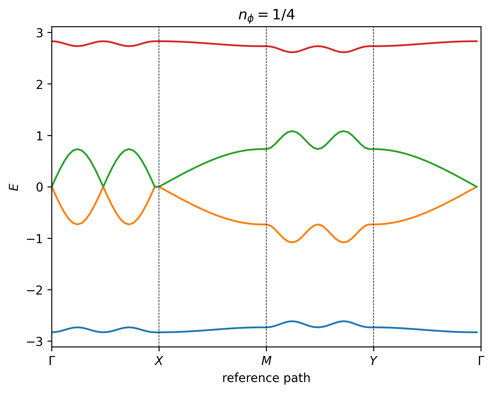

Band Structure
==============

The band structure for the Hofstadter model is computed by constructing a set of simultaneous time-independent Schrödinger equations for the basis sites, and then using the plane wave ansatz to formulate each equation as a difference relation. For simplicity, we start by discussing the band structure derivation for the conventional Hofstadter model, and then proceed to outline the general case.

To recap from the previous section, for Landau gauge in the y-direction :math:`\mathbf{A}=-By \hat{\mathbf{e}}_x`, the general formula for the **Peirels phase** acquired by an electron hopping from site :math:`i=(X_i,Y_i)` to site :math:`j=(X_j,Y_j)` is given as

.. math::
	\theta_{ij} = -2\pi n_\phi \Delta X \left( Y_i + \frac{\Delta Y}{2} \right),

where :math:`\Delta X = X_j - X_i`, :math:`\Delta Y = Y_j - Y_i`, and we have defined the flux density with respect to the UC area, such that :math:`n_\phi=BA_\mathrm{UC}/\phi_0 = Ba^2/\phi_0`. In what follows, let us index the UC coordinates using :math:`(m,n)`. The **time-independent Schrödinger equation** for the conventional nearest neighbor (NN) square-lattice Hofstadter model is then given as

.. math::
	E \Psi_{m,n} = -t e^{-\mathrm{i}2\pi n_\phi n} \Psi_{m+1, n} - t \Psi_{m, n+1} + \mathrm{H.c.},

where :math:`\Psi_{m,n}` is the wavefunction at unit cell :math:`(m,n)` and :math:`t` is the hopping amplitude. Since we have taken Landau gauge in the y-direction, it is reasonable to assume plane wave behavior in the x-direction. Hence we can simplify the equation further by invoking the **plane wave ansatz** :math:`\Psi_{m,n} = e^{\mathrm{i}\mathbf{r}\cdot\mathbf{k}}\psi_{n}`, such that

.. math::
	E \psi_{n} = -t e^{-\mathrm{i}2\pi n_\phi n + \mathrm{i}k_x} \psi_{n} - t e^{\mathrm{i} k_y}\Psi_{m} + \mathrm{H.c.},

which simplifies to

.. math::
   E\psi_{n} = B^*\psi_{n-1} + A_n \psi_{n} + B\psi_{n+1},

where

.. math::
   \begin{align}
       A_n &= -2t\cos(2\pi n_\phi n - k_x), \\
       B &= -t e^{\mathrm{i} k_y}.
   \end{align}

All distances are measured in units of the lattice constant :math:`a=1`. Given that there are :math:`q` sites in our MUC, this is a :math:`q`-dimensional difference equation, known as the **Harper equation**, which is a special case of an **almost Mathieu operator** :cite:`Harper55`. This equation may be readily written in matrix form, such that :math:`\mathbf{H} \boldsymbol{\psi} = E \boldsymbol{\psi}`, where :math:`\mathbf{H}` is a :math:`q\times q` Hamiltonian matrix and :math:`\boldsymbol{\psi}=(\psi_0, \psi_1, \dots, \psi_{q-1})^\intercal` is a vector of length :math:`q`. For the case of :math:`n_\phi=1/4`, the Hamiltonian matrix may be written explicitly as

.. math::
   \mathbf{H} =
   \begin{pmatrix}
   A_0 & B & 0 & B^* \\
   B^* & A_1 & B & 0 \\
   0 & B^* & A_2 & B \\
   B & 0 & B^* & A_3
   \end{pmatrix},

and hence there are 4 energy bands in the spectrum, as shown in the figures below.

.. image:: ../images/overview/band_structure_3D_both_square_nphi_1_4_t_1.png
    :width: 32 %
    :alt: 3D Band Structure
.. image:: ../images/overview/wilson_both_square_nphi_1_4_t_1.png
    :width: 32 %
    :alt: Wilson Loops

In the general case, the procedure follows in a similar way. We start by writing down the time-independent Schrödinger equation for each site in the basis, which we index using lowercase Greek letters :math:`\alpha,\beta`. This yields a set :math:`N_\mathrm{b}` simultaneous equations, which we can write in matrix form, such that :math:`\mathbf{H}\boldsymbol{\psi}=E\boldsymbol{\psi}`, where :math:`\boldsymbol{\psi}=(\psi^0, \psi^1, \dots, \psi^{N_\mathrm{b}-1})^\intercal` is a vector of length :math:`N_\mathrm{b}`, and the :math:`N_\mathrm{b}\times N_\mathrm{b}` Hamiltonian matrix is given as

.. math::
   \mathbf{H} =
   \begin{pmatrix}
   H^{00} & H^{01} & \dots \\
   H^{10} & H^{11} & \dots \\
   \vdots & \vdots & \ddots
   \end{pmatrix},

where :math:`H^{\alpha\beta}` is the Hamiltonian for hoppings from sublattice :math:`\alpha` to sublattice :math:`\beta`. Then, for each :math:`H^{\alpha\beta}` we can write down a :math:`q\times q` Harper matrix, as before. For Landau gauge in the y-direction :math:`\mathbf{A}=-By \hat{\mathbf{e}}_x`, the general form of the Harper matrix is given as

.. math::
	 \mathbf{H} = \begin{pmatrix}
							  \Lambda_{0,0} & \Lambda_{0,1} & \dots \\
							  \Lambda_{1,0} & \Lambda_{1,1} & \dots \\
							  \vdots & \vdots & \ddots
							  \end{pmatrix} +
							  \begin{pmatrix}
							  \ddots & \Lambda_{0, q-1}^* & \Lambda_{0, q}^* \\
							  \Lambda_{q-1, 0} & \ddots & \Lambda_{1, q}^* \\
							  \Lambda_{q, 0} & \Lambda_{q, 1} & \ddots
							  \end{pmatrix},

where :math:`\Lambda_{l, n}` is the diagonal function, and we have dropped the :math:`\alpha\beta` superscripts for readability. The second matrix simply accounts for rolled over boundary terms. Since we are working in Landau gauge in the y-direction, the **diagonal function** may be written as

.. math::
        \Lambda_{l, n} = - \sum_\kappa \sum_{\langle ij \rangle_{\kappa}^l} t_\kappa e^{\\\mathrm{i}\theta_{ij}} e^{\\\mathrm{i}\\\mathbf{k}\cdot\\\mathbf{r}},

where :math:`\langle \dots \rangle^l_\kappa` denotes the subset of :math:`\kappa`-th nearest neighbors with a net :math:`y` unit cell displacement of :math:`l`, :math:`\theta_{ij}` is the Peierls phase, :math:`\\\mathbf{k}` is the momentum vector, and :math:`\\\mathbf{r}` is the displacement vector. We emphasize that hoppings that are related by Hermitian conjugation, which are *outside the scope of the unit cell*, are not included in the diagonal function matrix. For example, for NN hopping on the triangular lattice, we include 3 of the 6 nearest neighbors in the diagonal function matrix, and the rest are captured when we add on the Hermitian conjugate to the Hamiltonian. However, for NN hopping on the kagome lattice, we include all 4 of 4 nearest neighbors for each basis site, since they are all within the same unit cell. Overall, we are left we left with a :math:`N_\mathrm{b}q\times N_\mathrm{b}q` block Hamiltonian matrix, which yields :math:`N_\mathrm{b}q` bands.

In HofstadterTools, we can analyze the resulting band structure by computing its key properties, which are listed in the tables below. These **band properties** may be selected in the file ``code/configuration/band_structure.py``, and are grouped by computational expense. By default, HofstadterTools prints properties in the basic and topology groups only (for speed reasons). When computing topology and quantum geometry properties of bands, it is important to use *manifestly gauge invariant* expressions, so that we omit spurious Bloch phase factors and can compute the quantities quickly and accurately. To this end, we use the Fukui formula to compute the (first) Chern number :cite:`Fukui05` and the projector formalism to compute the quantum geometric tensor :cite:`Mera22`.

.. note::
	The Chern numbers of the bands may also be inferred by plotting the **Wilson loops**, which are the products of Berry phases around cycles of the Brillouin zone, as shown in the middle figure above. The magnitude of the Chern number corresponds to the number of windings of the Wilson loop and the sign of the Chern number corresponds to its direction.

In the projector formalism, the **quantum geometric tensor** is defined as

.. math::
   \mathcal{R}_{\mu\nu}(\mathbf{k}) = \mathrm{tr}(\mathcal{P}_\mathbf{k}\partial_{k_\mu}\mathcal{P}_\mathbf{k} \partial_{k_\nu} \mathcal{P}_\mathbf{k}),

where :math:`\mathcal{P}_\mathbf{k} = \sum_n^{N_\mathrm{g}} \ket{u_n(\mathbf{k})} \bra{u_n(\mathbf{k})}` is the band projector, :math:`\ket{u_n(\mathbf{k})}` is the eigenvector of band :math:`n` at momentum :math:`\mathbf{k}`, and :math:`N_\mathrm{g}` is the number of touching bands in a band group.  The real part of the quantum geometric tensor is given by the Fubini-Study metric :math:`g_{\mu\nu}(\mathbf{k})=\Re[\mathcal{R}_{\mu\nu}]`, which corresponds to the distance between eigenstates on the Bloch sphere, whereas the imaginary part of the quantum geometric tensor is given by the Berry curvature :math:`\mathcal{B}(\mathbf{k})=-2 \Im [\mathcal{R}_{01}(\mathbf{k})]`. Crucially, since band geometry and topology are components of the same tensor, we can derive relations between them, namely

.. math::
   \begin{align}
   \mathcal{D}(\mathbf{k})&=\text{det}\,g(\mathbf{k}) - \frac{1}{4}|\mathcal{B}(\mathbf{k})|^2 \geq 0, \\
   \mathcal{T}(\mathbf{k})&=\text{tr}\,g(\mathbf{k}) - |\mathcal{B}(\mathbf{k})| \geq 0,
   \end{align}

where we define :math:`\mathcal{D}` as the **determinant inequality saturation measure (DISM)** and :math:`\mathcal{T}` as the **trace inequality saturation measure (TISM)**. It has been shown analytically that when the trace(determinant) inequality is saturated for a Chern band, the algebra of projected density operators is identical(isomorphic) to that in Landau levels :cite:`Roy14`.

Using these band properties, we can perform several sanity checks on our computed band structures. In terms of band topology, we know that all of the Chern numbers in a Hofstadter spectrum must sum to zero. In terms of band geometry, we know that as we take the Landau level limit :math:`q\to\infty`, the TISM and DISM must monotonically approach zero from above.

.. note::
	The band structures can also be checked by comparing against results in the literature. For example, the Chern numbers can be benchmarked against Fig.2.6 of :cite:`AidelsburgerPhD` and the values of the TISM can be benchmarked against Fig.3 of :cite:`Bauer22`.

.. list-table:: Basic Properties
   :widths: 10 10 10 70
   :header-rows: 1

   * - Alias
     - Name
     - Symbol/Formula
     - Description
   * - ``band``
     - Band Number
     - :math:`n`
     - Bands are numbered in ascending order, with respect to energy, starting from zero.
   * - ``group``
     - Band Group
     - N/A
     - Bands are considered grouped when they are touching within the band gap threshold.
   * - ``isolated``
     - Isolated Band Flag
     - N/A
     - A band is isolated when it is not touching any other bands, i.e. it is a member of a band group of size one.
   * - ``width``
     - Band Width
     - :math:`W = \mathrm{max}(E_n) - \mathrm{min}(E_n)`
     - The band width for an isolated band (group) is the difference between the largest and smallest energies in that band (group).
   * - ``gap``
     - Band Gap
     - :math:`\Delta = \mathrm{min}(E_{n+1}) - \mathrm{max}(E_n)`
     - The band gap for an isolated band (group) is the difference between the smallest and largest energies of the subsequent and current bands.
   * - ``gap_width``
     - Gap-to-width Ratio
     - :math:`\Delta/W`
     - The gap-to-width ratio for an isolated band (group) is defined as the ratio between the band gap and width.

.. list-table:: Topology Properties
   :widths: 10 10 10 70
   :header-rows: 1

   * - Alias
     - Name
     - Symbol/Formula
     - Description
   * - ``std_B``
     - Berry Curvature Fluctuations
     - :math:`\hat{\sigma}_{\mathcal{B}} = \sigma_\mathcal{B} / \mu_\mathcal{B}`
     - For :math:`C=1` bands, this definition is equivalent to Eq.(6) from :cite:`Jackson15`.
   * - ``C``
     - (First) Chern Number
     - :math:`C=\frac{1}{2\pi} \iint_\mathrm{BZ} \mathcal{B}(\mathbf{k}) \mathrm{d}^2 k`
     - The Chern number is an integer and is computed using the Fukui formula :cite:`Fukui05`.

.. list-table:: Geometry Properties
   :widths: 10 10 10 70
   :header-rows: 1

   * - Alias
     - Name
     - Symbol/Formula
     - Description
   * - ``std_g``
     - Fubini-Study Metric Fluctuations
     - :math:`\sigma_{g} = \sqrt{\frac{1}{2}\sum_{ij} \sigma^2_{g_{ij}}}`
     - This definition is equivalent to Eq.(8) from :cite:`Jackson15`.
   * - ``av_gxx``
     - Mean of the Diagonal Fubini-Study Metric
     - :math:`\mu_{g_{xx}}`
     - This quantity is equal to :math:`\mu_{g_{yy}}` and is studied in :cite:`Bauer16`.
   * - ``av_gxy``
     - Mean of the Off-diagonal Fubini-Study Metric
     - :math:`\mu_{g_{xy}}`
     - This quantity is equal to :math:`\mu_{g_{yx}}` and is studied in :cite:`Bauer16`.
   * - ``std_gxx``
     - Standard Deviation of the Diagonal Fubini-Study Metric
     - :math:`\sigma_{g_{xx}}`
     - This quantity is equal to :math:`\sigma_{g_{yy}}` and is studied in :cite:`Bauer16`.
   * - ``std_gxy``
     - Standard Deviation of the Off-diagonal Fubini-Study Metric
     - :math:`\sigma_{g_{xy}}`
     - This quantity is equal to :math:`\sigma_{g_{yx}}` and is studied in :cite:`Bauer16`.
   * - ``T``
     - Brillouin-zone-averaged Trace Inequality Saturation Measure (TISM)
     - :math:`\langle\mathcal{T}\rangle = \langle \mathrm{tr} g(\mathbf{k}) - |\mathcal{B}(\mathbf{k})| \rangle`
     - The TISM is non-negative and defined in Eq.(10) of :cite:`Jackson15`.
   * - ``D``
     - Brillouin-zone-averaged Determinant Inequality Saturation Measure (DISM)
     - :math:`\langle\mathcal{D}\rangle = \langle \mathrm{det} g(\mathbf{k}) - \mathcal{B}^2(\mathbf{k})/4 \rangle`
     - The DISM is non-negative and defined in Eq.(9) of :cite:`Jackson15`.
