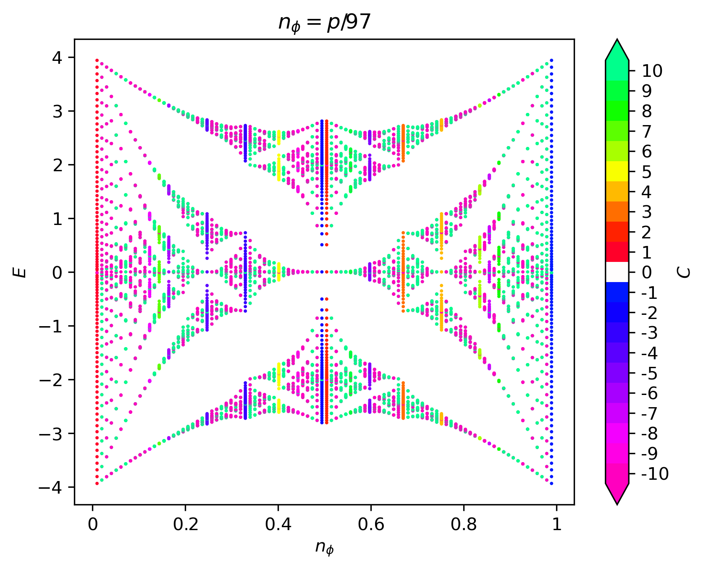
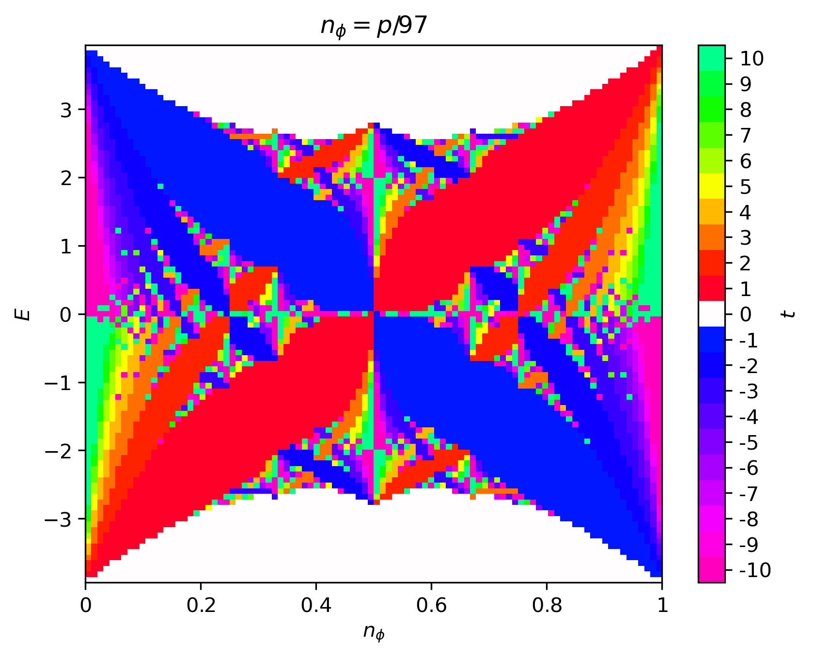
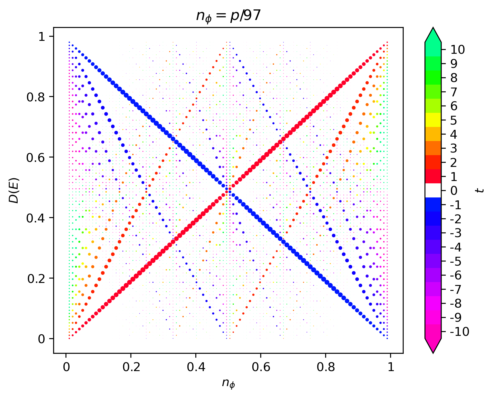

Butterfly
=========

The famous butterfly spectrum of the Hofstadter model was first plotted by Douglas Hofsatder in 1976 :cite:`Hofstadter76` and later colored in by Joseph Avron in 2003 :cite:`Avron03`. The beautiful fractal structure is a result of the incommensurability between the MUC area and the irreduicble area occupied by a quantum of flux. In this section, we explain how the Hofstadter butterfly is computed and colored in HofstadterTools.

The **butterfly spectrum** is a plot of energy :math:`E` against flux density :math:`n_\phi=p/q`, where :math:`p` and :math:`q` are coprime, and is constructed by sweeping over :math:`p` at fixed :math:`q`. As we have seen in the previous section, the bands in the Hofstadter model generally have a :math:`\mathbf{k}`-dependence. However, as we approach the Landau level limit :math:`q\to\infty`, the band structure approaches the Landau level spectrum, where the bands are perfectly flat. In HofstadterTools, we plot the butterfly spectrum using the :math:`\Gamma`-point of each band at :math:`\mathbf{k}=(0,0)`, with the understanding that this is only representative of the band structure when :math:`q` is large. Since a large :math:`q` needs to be chosen in order to plot a convincing butterfly spectrum in any case, this is a reasonable approximation to make. Alternative methods include, for example, taking an average over :math:`\mathbf{k}` for each band and at each flux density, however this increases the computational cost significantly. Moreover, in addition to choosing a large :math:`q` for the butterfly computations, it is also most efficient to choose a prime number, since the flux density is defined as a coprime fraction :math:`n_\phi=p/q`. If a non-prime :math:`q` is chosen, then you will notice gaps in the x-values of the butterfly, since values of :math:`p` that yield an inadmissible :math:`n_\phi` will be skipped.

The Hofstadter butterfly may be colored in variety of ways. For example, we may **color the points** of the butterfly by their Chern number, as shown in the left figure below. The disadvantage of this, is that there will be many points in the butterfly and so the fine details of the coloring may be obscured. Moreover, the Chern number magnitude range will increase with :math:`q` and so it is difficult to define a fixed scale. By default, HofstadterTools uses a scale for Chern numbers of magnitude up to 10. An alternative, and usually preferred, method is to **color the plane** of the butterfly by the cumulative Chern numbers of the gaps, as shown in the middle figure below. The cumulative Chern numbers are consistent with increasing :math:`q` and they are intimately connected with the Hall conductivity in the quantum Hall effect. As before, HofstadterTools uses a scale for Chern numbers of magnitude up to 10, by default, as well as the color palette made famous by Avron. To complement the butterfly spectra, we may also plot the **Wannier diagram**, which shows the integrated density of states, as in the right figure below. The size of the points is proportional to the size of the gaps and the color is given by the cumulative Chern number. The gradients of the slopes may be used to infer the Hall conductivity, which is particularly useful for connecting with experiments :cite:`DiColandrea22`.

In the butterfly spectra, we are computing the band structure with :math:`q` bands, up to :math:`q-1` times, where we typically have :math:`10^2<q<10^3`. These are comparatively large band structures, which are fortunately not excessively computationally expensive, since we are only computing each spectrum at the :math:`\Gamma`-point. However, we are coloring the spectra using the Chern numbers of the bands, which for our `band_structure` program was computed using the Fukui formula :cite:`Fukui05`. This formula involves a numerical integration over the entire Brillouin zone, which would be too computationally demanding in this case. Fortunately, for most butterfly spectra, there is a faster way to infer the Chern numbers, known as the **Streda-Widom Diophantine relation**. For a rational flux, it is easy to show that the energy gaps in the Hofstadter spectrum are characterized by the integers :math:`s` and :math:`t`, which are related by the Diophantine equation,

    .. math::
        r = qs_r + pt_r, \;\;\; |t_r|\leq\frac{q}{2}, \;\;\; s_r,t_r\in\mathbb{Z},

where :math:`r` denotes the :math:`r`-th energy gap and :math:`t_r=\sum_{i=1}^r C_i` is the cumulative Chern number or Hall conductivity. The inequality :math:`|t_r|\leq\frac{q}{2}` is known as the **natural window condition**, and for rectangular lattices, it completely resolves any Chern number ambiguity. For non-rectangular lattices, there remains a Chern number ambiguity, which may impact the fine details of the butterfly coloring :cite:`Agazzi14`. In HofstadterTools, we exclusively color the butterfly spectra using the Streda-Widom Diophantine relation with the understanding that, for non-rectangular lattices, this *may* result in minor undesired numerical artifacts. As with the :math:`\Gamma`-point decision for the bands, this is a slight compromise in precision for the sake of a huge gain in efficiency.
